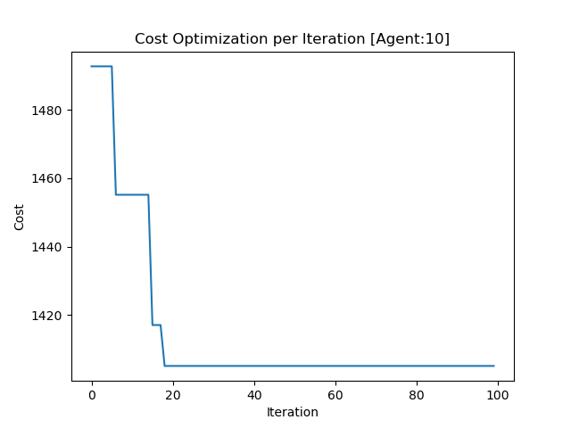
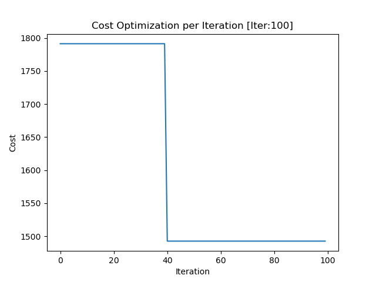
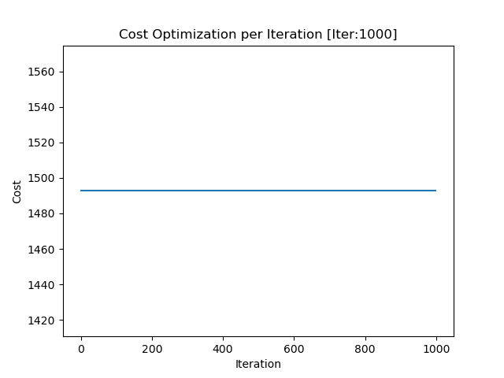
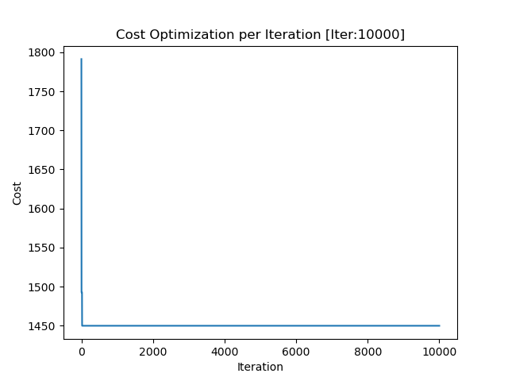
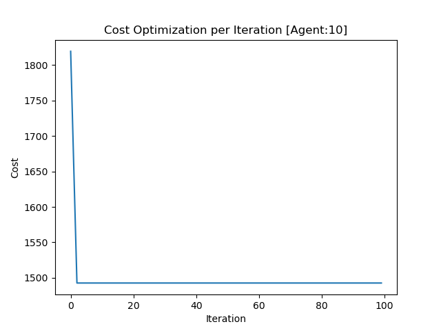
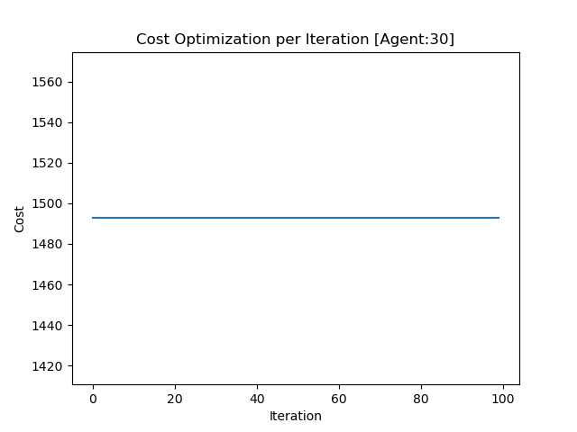

# Logistic Delivery Optimization
To become a good or efficient logistics manager, it requires significant experience and the consideration of various factors such as time, fuel prices, traffic, availability of manpower, and more. This project will introduced the concept of metaheuristic optimization in optimizing the cost of delivering goods to customers. The metaheuristic used in this project is Grey Wolf Optimizer (GWO) due to its simplistic explaination to public.

# What is Metaheuristic Optimization?
Generally, optimization expert divide optimization technique to two main branches which were heuristic approach and metaheuristic approach. So whats the differences? In a simple word, heuristic approach refer to greedy approach or by computing all possible computation in order to find the optimal solution while metaheuristic are basically used intelligent computation (typically mimic real-world scenario) to solve a problem that consumed least amount of time compared to heuristic approach.

# Metaheuristic
## Grey Wolf Optimizer
Grey Wolf Optimizer or GWO were introduced by S. Mirjalili in 2014 which inspired by the grey wolves (Canis lupus). The main idea of this algorithm is the wolves action such as exploring area and hunting for food. Nevertheless, the full concept and implementation will not be discussed in this chapter.

# Objective Function
## 2-Opt Approach
The main idea of this objective function is to take a route that crosses which each other and reoder it so that crossover wont occur. This method will compare every possible valid combination of the swapping mechanism. Again, this chapter will not cover the whole mechanism

# Experiment

## 000: Exploring GWO Base Hyperparameter

The first experiment are to explored the capabilties of GWO in this optimization problem. Base hyper-parameter setting are with 10 search agents with 100 iterations. Furthermore, in this expriment, the algorithm will automatically choose the vehicle type for logistic delivery optimization.

  

    <em>Figure 1: Cost-Distance-Vehicle Optimization</em>

## 001: Exploring GWO Iteration On Objective Function (Cost)

Based on the results belows, there are no correlation can be made from the increased iteration and the cost indicator. It is also seems that the GWO stuck in local optimal solution as no further minimization occur in between cost ranging from RM 1400 to RM 1500.

    <table>
        <tr>
            <td></td>
            <td></td>
            <td></td>
        </tr>
    </table>

    <em>Figure 2: Iteration Impact On Optimization</em>

## 002: Exploring GWO Number Of Agents On Objective Function (Cost)

Similiar to previous experiment, there are no clear correlation can be made based on the increase number of agents toward the objective function of cost. Again, the GWO seems to stuck at local optimal solution as no further minimization occur in between cost ranging from RM 1400 to RM 1500.

    <table>
        <tr>
            <td></td>
            <td></td>
            <td></td>
        </tr>
        <tr>
            <td></td>
            <td></td>
        </tr>
    </table>

    <em>Figure 3: Number Of Agent Impact On Optimization</em>

# Further Work Recommendation
There are several improvement can be made to achieved better results such as introducing new objective function technique, introduced new algorithm, implement Simulated Annealing (SA) with GWO for better solution quality. While the experiment dont look promising, it is important to identify such problem and presented possible solution to make thing possible.